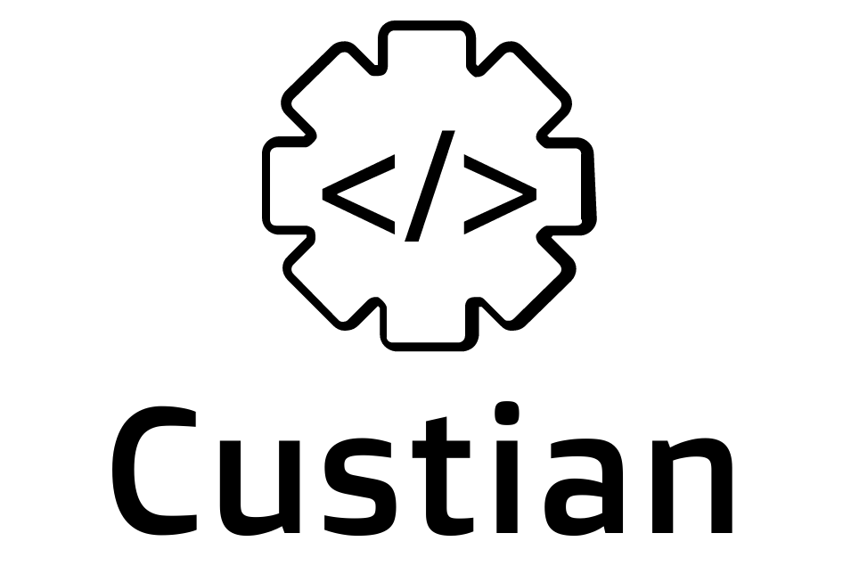

# Custian

A custom debian live-build image with useful stuff preloaded.

This has been made for my use but others might find it useful as a live CD of debian with i3 Window manager and other tools.

*Custom graphic by <a href="http://www.freepik.com/">Freepik</a> from <a href="http://www.flaticon.com/">Flaticon</a> is licensed under <a href="http://creativecommons.org/licenses/by/3.0/" title="Creative Commons BY 3.0">CC BY 3.0</a>. Made with <a href="http://logomakr.com" title="Logo Maker">Logo Maker</a>*
